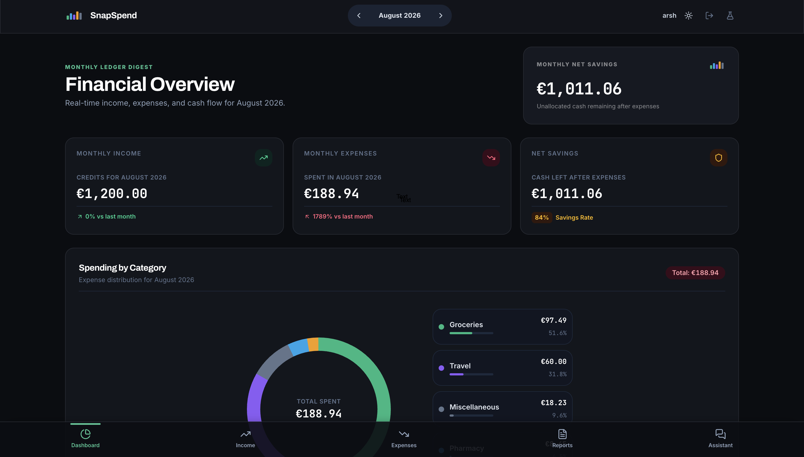
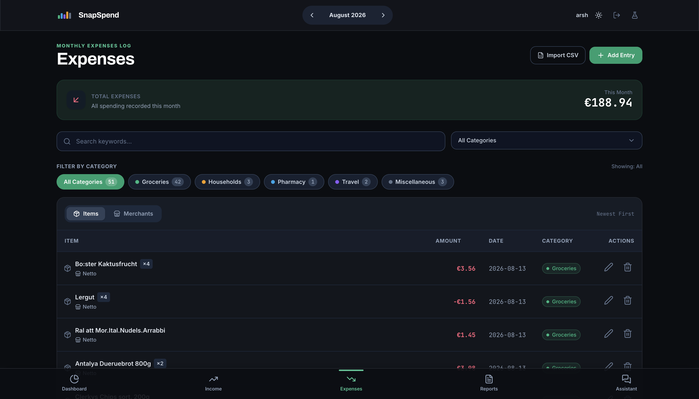
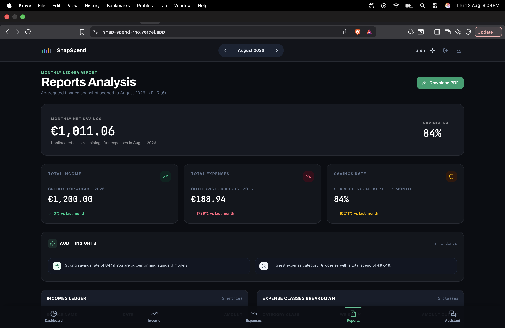
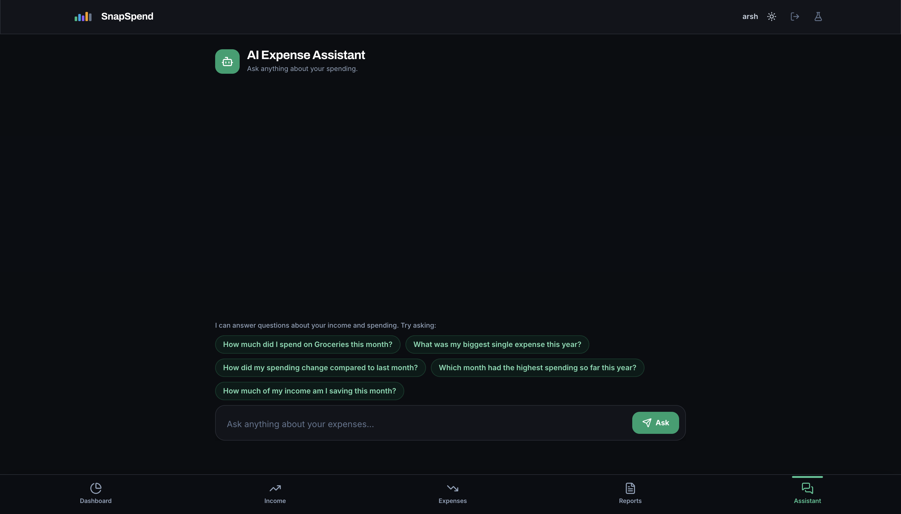

<div align="center">


# SnapSpend

**AI-powered, privacy-first expense tracking — right in your browser.**

[](https://snap-spend-rho.vercel.app/)


[](LICENSE)

:star: If you like this project, star it on GitHub — it helps a lot!

[Overview](#overview) • [Features](#features) • [Screenshots](#screenshots) • [Demo](#demo) • [Getting started](#getting-started) • [AI features](#ai-features) • [Deployment](#deployment)



</div>

## Overview

SnapSpend turns your spending into something you can actually understand. Upload a receipt photo and it becomes a structured, categorised expense entry. Ask questions about your money in plain English and the built-in assistant answers from **your own data** — never inventing numbers.

Everything runs client-side against a Postgres database locked down with Row-Level Security, so your financial data stays yours. SnapSpend also ships a standalone **evaluation module** that benchmarks how accurately different AI models parse receipts.

> [!NOTE]
> SnapSpend is a vanilla JavaScript (ES6+) single-page app — no framework runtime — built with Vite, Tailwind CSS v4, and Supabase.

## Features

- **AI receipt scanning** — upload a receipt photo and get structured JSON (vendor, date, total, itemized lines with categories) to review before saving.
- **AI assistant** — ask questions like *"How much did I spend on Groceries this month?"* and get grounded answers sourced only from your data.
- **Dashboard** — monthly income, expenses, and net savings, plus a spending-by-category chart across five canonical categories.
- **Income & expenses** — monthly income logs with one-click salary copy, manual expenses with on-device category suggestions, and CSV import.
- **Reports & PDF export** — a monthly snapshot with savings rate, month-over-month deltas, and a clean single-page PDF.
- **Auth & bot protection** — username + email + password sign-up guarded by Cloudflare Turnstile.
- **Evaluation module** — benchmark any number of models × system prompts on receipts against ground-truth JSON.

## Screenshots

<div align="center">
  
  
  <br />
  
  
</div>

## Demo

Watch SnapSpend in action:

<p align="center">
  <a href="https://www.youtube.com/watch?v=YOUR_VIDEO_ID">
    
  </a>
</p>

> [!NOTE]
> Replace `YOUR_VIDEO_ID` in the link above with your YouTube video. The thumbnail and screenshots live in `docs/images/`.

## Getting started

### Prerequisites

- **Node.js** v18.0.0 or higher
- **npm** v9.0.0 or higher
- A free **Supabase** project

### 1. Configure Supabase

1. Create a project from your [Supabase dashboard](https://supabase.com/dashboard).
2. In the **SQL Editor**, run `schema.sql` against your database.
   - Upgrading an existing SnapSpend database? Run the migration scripts under `supabase/migrations/` in order (`0001` → `0002` → `0003`). **Back up your database first.**
3. Copy `.env.example` to `.env` and add `VITE_SUPABASE_URL` and `VITE_SUPABASE_ANON_KEY`.
4. *(Optional)* Enable **Cloudflare Turnstile**: create a widget at `dash.cloudflare.com → Turnstile`, put its **Site Key** in `.env` as `VITE_TURNSTILE_SITE_KEY`, and paste its **Secret Key** in Supabase → *Authentication → Bot and Abuse Protection*.

### 2. Install & run

```bash
npm install
cp .env.example .env   # then fill in your keys
npm run dev            # http://localhost:3000
```

### Development commands

| Command           | Description                                      |
| ----------------- | ------------------------------------------------ |
| `npm run dev`     | Start the Vite development server on port 3000   |
| `npm run build`   | Build the application for production             |
| `npm run preview` | Preview the production build locally             |
| `npm run lint`    | Type-check with `tsc --noEmit`                   |
| `npm run test`    | Run the Node.js native test suite                |
| `npm run clean`   | Remove the production build output               |

### Environment variables

All variables live in `.env` (see `.env.example`). `VITE_` variables are baked into the client bundle — never put server-side secrets in them.

| Variable                   | Purpose                                                             |
| -------------------------- | ------------------------------------------------------------------- |
| `VITE_SUPABASE_URL`        | Supabase project URL (e.g. `https://your-project.supabase.co`)      |
| `VITE_SUPABASE_ANON_KEY`   | Supabase anon (public) API key                                      |
| `VITE_GEMINI_API_KEY`      | Gemini API key — used by the receipt ParserEngine (app + eval)      |
| `VITE_OPENROUTER_API_KEY`  | OpenRouter API key — used by the evaluation module                  |
| `VITE_TURNSTILE_SITE_KEY`  | Cloudflare Turnstile site key — bot protection on auth (optional)   |

The AI Assistant edge function uses server-side secrets set with the Supabase CLI (see below), **not** `.env`.

## Project structure

```text
SnapSpend/
├── css/                     # Base styles & fluid typography
├── js/                      # App modules (router, views, AI, receipt parser)
├── supabase/
│   ├── functions/assistant  # AI assistant edge function (Deno)
│   └── migrations/          # Upgrade scripts for existing databases
├── eval/                    # Dataset builder & evaluation CLI
├── tests/                   # Node.js test suite
├── .env.example             # Environment variable template
├── index.html               # Application shell
├── schema.sql               # Fresh PostgreSQL schema & RLS policies
└── vite.config.ts           # Vite configuration
```

## AI features

### ParserEngine

`js/parserEngine.js` turns receipt images into structured JSON. It supports a **Gemini** provider (default, with `response_schema` structured output) and an **OpenRouter** provider (any vision-capable model, JSON mode + schema in the prompt). Both normalize item categories onto the canonical five and return the same shape.

### AI Assistant

Ask questions about your spending in plain English and get grounded, plain-text answers sourced only from your data — always scoped to the signed-in user. Two execution paths:

1. **Supabase Edge Function (text-to-SQL)** — the LLM receives the schema and few-shot SQL examples, calls a validated, read-only `query_expenses` tool, and the edge function runs the statement scoped to the authenticated user. Recommended for production:

   ```bash
   supabase login
   supabase link --project-ref YOUR_PROJECT_REF
   supabase secrets set GEMINI_API_KEY=your-gemini-key
   supabase functions deploy assistant
   ```

2. **Client-side fallback** — when running without the edge function (e.g. Vercel builds), `js/assistantClient.js` talks to Gemini directly from the browser and drives eight deterministic stats tools, so totals always match the app's own pages.

Provider and models are configurable via edge function secrets (`ASSISTANT_PROVIDER`, `SQL_MODEL`, `OPENROUTER_MODEL`).

### Evaluation module

The tooling under `eval/` benchmarks receipt parsing pipelines — models × system prompts × setups — against ground-truth JSON:

```bash
node eval/build-dataset.mjs   # annotate receipt images with model setups
node eval/run-eval.mjs        # score setups vs ground truth, ranked reports
```

The browser harness at `/eval.html` uses the same hardened OpenRouter client as the CLI (free-tier pacing, retries with backoff, early-stop on quota exhaustion).

## Security & privacy

- **No third-party tracking** — your ledger data is never sent to analytics services.
- **Row-Level Security** — every financial record is protected by `auth.uid() = user_id`.
- **Bot protection** — Cloudflare Turnstile guards every sign-in and sign-up.
- **Assistant data safety** — the assistant only issues read-only, per-user queries, and answers anything outside its data scope verbatim.
- **Input sanitization** — user text is HTML-escaped before rendering.

> **Security Notice:** No software can guarantee absolute security. Please report suspected vulnerabilities according to the project's security disclosure policy.

## Deployment

SnapSpend builds to a static site and deploys as-is to **Vercel** (or any static host):

```bash
npm run build
npx vercel --prod
```

**Live demo:** https://snap-spend-rho.vercel.app/

> [!NOTE]
> On static/Vercel builds the AI Assistant runs in client-side mode (Gemini). For the recommended server-side text-to-SQL setup, deploy the Supabase edge function described in [AI features](#ai-features).